# LAB6 - Static Code analysis (with Sonar Qube)

### Análise de código estático (com Sonar Qube)

Esta análise chama-se estática pois o código não é executado, existe apenas uma análise do código escrito.

### Instalação do _Sonar Qube_ com a imagem _Docker_

Para instalar foi utilizada a imagem _Docker_, com o seguinte comando:
```jsx
docker run -d --name sonarqube -e SONAR_ES_BOOTSTRAP_CHECKS_DISABLE=true -p 9000:9000 sonarqube:latest
```

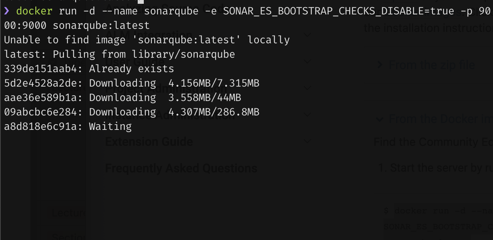

Ficando disponível a interface em [http://localhost:9000](http://localhost:9000/) com as seguintes credenciais de administrador:

- login: admin
- password: admin


**Interface**

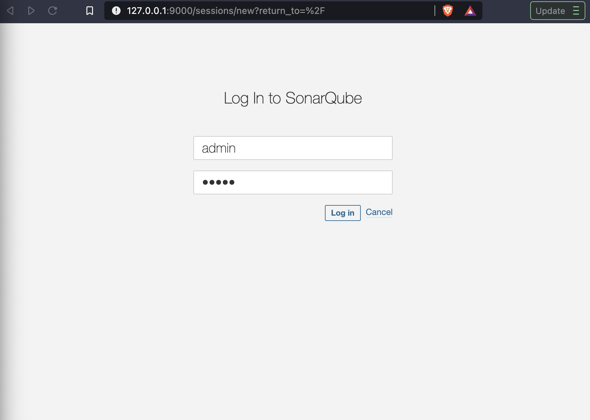

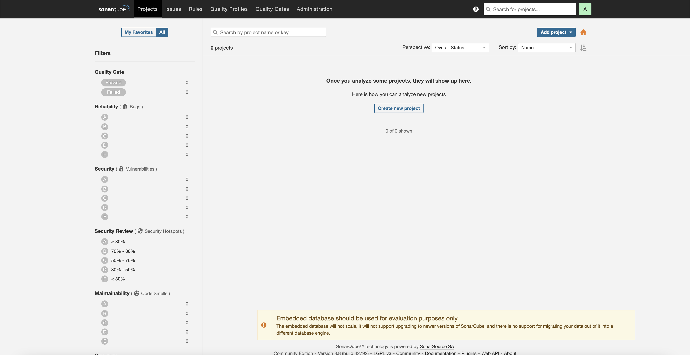

---

### Instalação do _Sonar Qube_ com a imagem _Docker_

Irá-se alterar as configurações gerais do _Maven_ para que todos os projetos em _Maven_ a partir de agora executem análise de código estático também no _Sonar Qube_ de acordo com as seguintes instruções:

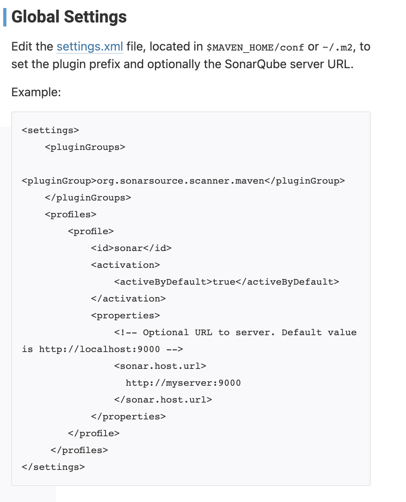

Posto isto, foi gerado um _authentication token_ para ser usado durante a análise de código de modo a permitir o login no container de _Sonar Qube_:

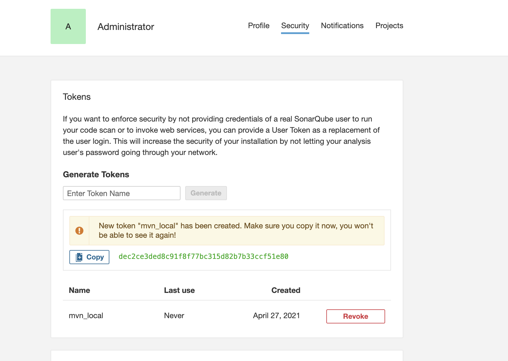

E executada a análise de código juntamente com os testes e outros _Maven lifecycles_:

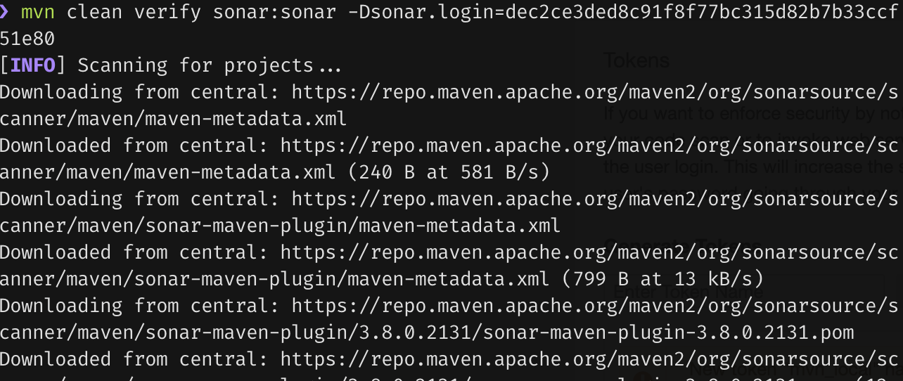

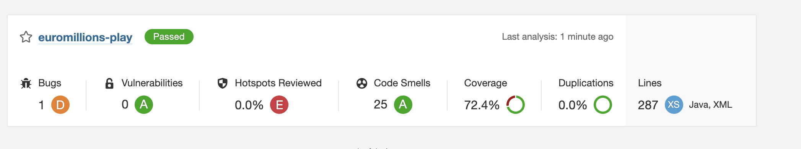

Por fim, foram analisados os resultados com alguns problemas de exemplo:

|Issue|Problem description|How to solve|
|--|--|--|
| | Creating a new `Random` object each time a random value is needed is inefficient and may produce numbers which are not random depending on the JDK. The `Random()` constructor tries to set the seed with a distinct value every time. However there is no guarantee that the seed will be random or even uniformly distributed. | For better efficiency and randomness, create a single `Random`, then store, and reuse it. |
|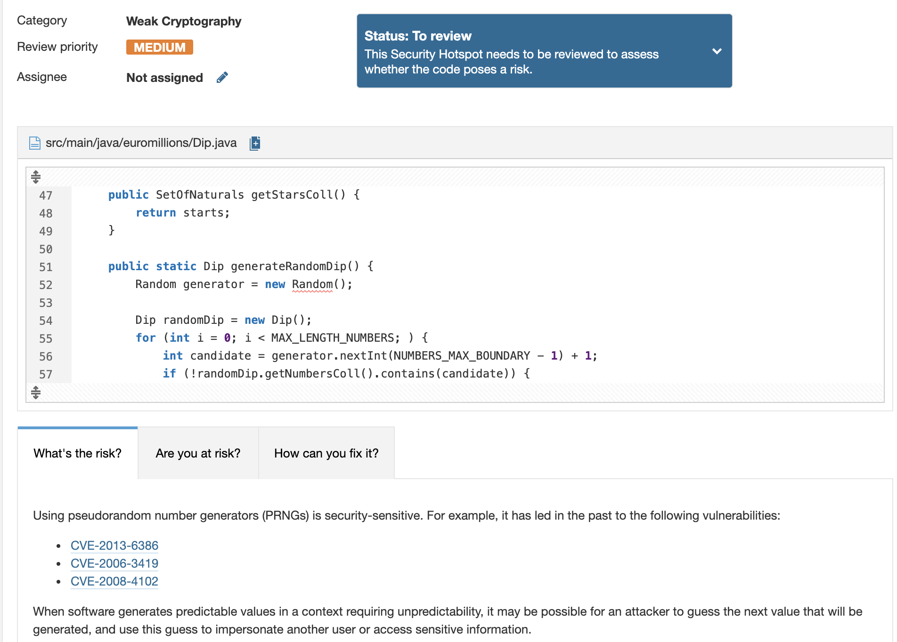| In this case is not really an issue since that the context doesn't really requires an unpredictability value every time. | If this was really an issue, it could be used a cryptographically strong random number generator (RNG) like "java.security.SecureRandom" in place of this PRNG. |
|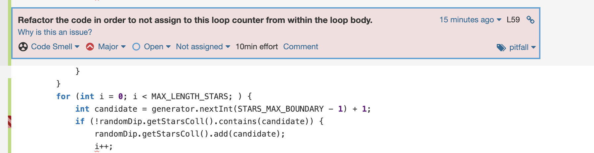| Loop counter assigned from within the loop body | Add to the loop counter on the `for` loop definition |


# Resolução de Problemas

Os problemas foram analisados e os categorizados com o_Major_ e _Critical_ resolvidos

**Antes:**

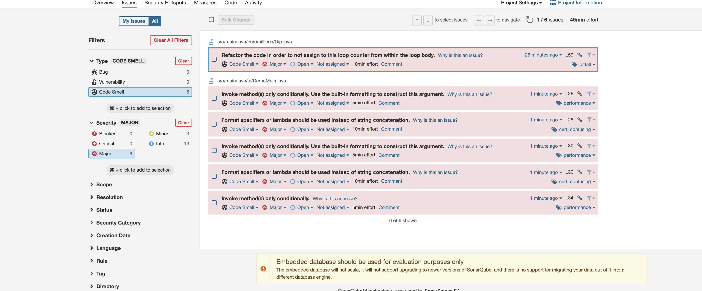

**Depois:**

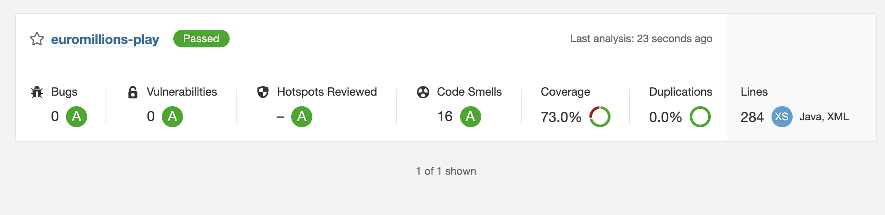

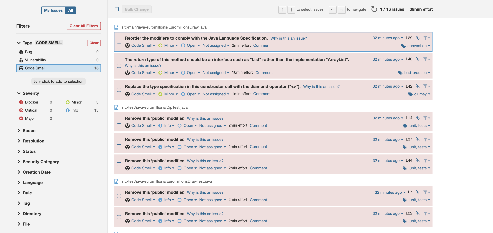

Foi adicionado o _Jacoco Plugin_ para verificar a % de código testado:

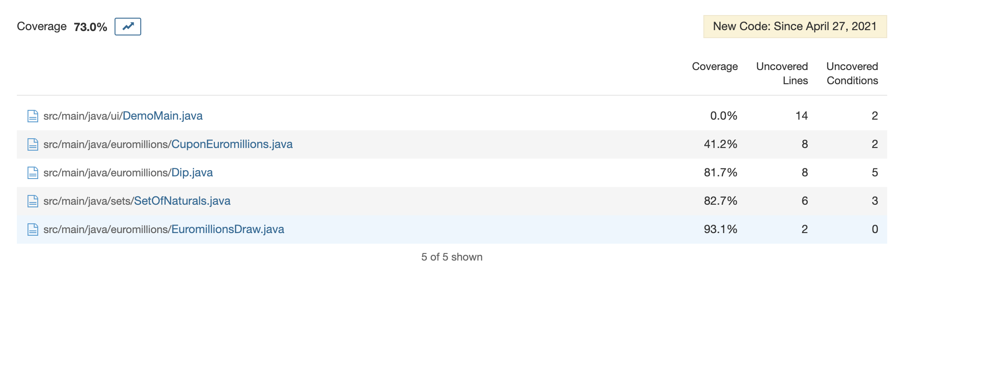

A classe que ofereceu menos cobertura foi a CuponEuromillions uma vez que não existiam testes para a função format e esta ocupava grande parte do código. A classe Dip apenas não tinha testes para as funções automaticamente implementadas e, a classe EuromillionsDraw, possuia dois métodos curtos sem testes.

### Análise de código estático no _IDE_

Foi instalado o _Sonar Qube_ no _IDE_ para executar análise de código estático:


