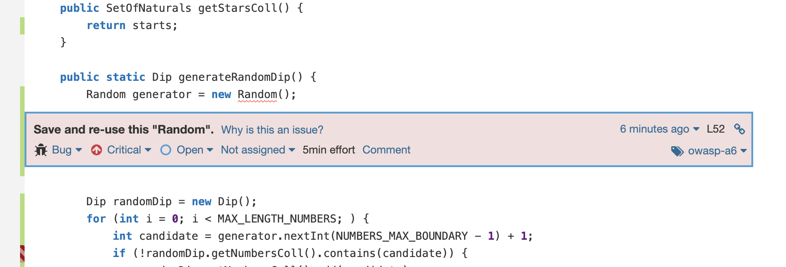
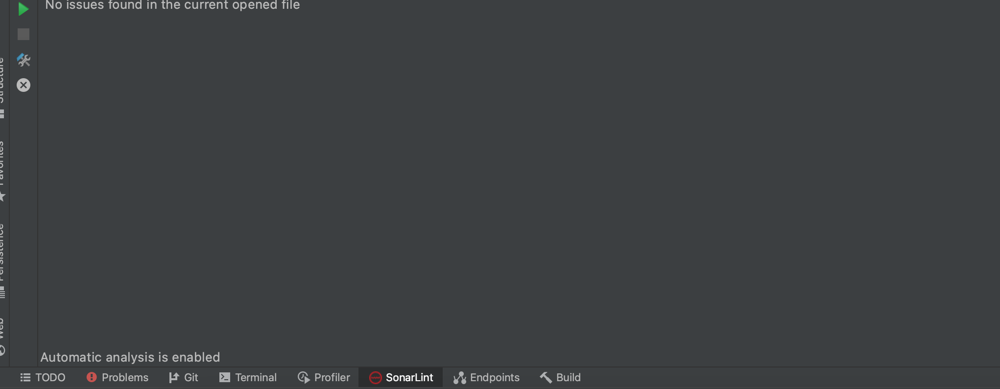

# LAB6 - Static Code analysis (with Sonar Qube)

### Análise de código estático (com Sonar Qube)

Esta análise chama-se estática pois o código não é executado, existe apenas uma análise do código escrito.

### Instalação do _Sonar Qube_ com a imagem _Docker_

Para instalar foi utilizada a imagem _Docker_, com o seguinte comando:
```jsx
docker run -d --name sonarqube -e SONAR_ES_BOOTSTRAP_CHECKS_DISABLE=true -p 9000:9000 sonarqube:latest
```


Ficando disponível a interface em [http://localhost:9000](http://localhost:9000/) com as seguintes credenciais de administrador:

- login: admin
- password: admin


**Interface**


---

### Instalação do _Sonar Qube_ com a imagem _Docker_

Irá-se alterar as configurações gerais do _Maven_ para que todos os projetos em _Maven_ a partir de agora executem análise de código estático também no _Sonar Qube_ de acordo com as seguintes instruções:


Posto isto, foi gerado um _authentication token_ para ser usado durante a análise de código de modo a permitir o login no container de _Sonar Qube_:


E executada a análise de código juntamente com os testes e outros _Maven lifecycles_:


Por fim, foram analisados os resultados com alguns problemas de exemplo:

|Issue|Problem description|How to solve|
|--|--|--|
| | Criar um novo objeto `Random` cada vez que um valor aleatório é necessário é ineficiente e pode produzir números que não são aleatórios dependendo do JDK. O construtor `Random ()` tenta definir a semente com um valor distinto todas as vezes. No entanto, não há garantia de que a semente será aleatória ou mesmo distribuída uniformemente. | Para obter melhor eficiência e aleatoriedade, pode-se criar um único `Random`, armazená-lo e reutilizá-lo. |
|| Neste caso, não é realmente um problema, pois o contexto não exige um valor de imprevisibilidade todas as vezes. | Se isso fosse realmente um problema, poderia ser usado um gerador de números aleatórios (RNG) criptograficamente forte como "java.security.SecureRandom" no lugar deste PRNG. |
|| Contador de `loop` atribuído de dentro do corpo do `loop` | Adicionar o contador de `loop` na definição de `loop` `for` |


# Resolução de Problemas

Os problemas foram analisados e os categorizados com o _Major_ e _Critical_ resolvidos

**Antes:**


**Depois:**


Foi adicionado o _Jacoco Plugin_ para verificar a % de código testado:


A classe que ofereceu menos cobertura foi a CuponEuromillions uma vez que não existiam testes para a função format e esta ocupava grande parte do código. A classe Dip apenas não tinha testes para as funções automaticamente implementadas e, a classe EuromillionsDraw, possuia dois métodos curtos sem testes.

### Análise de código estático no _IDE_

Foi instalado o _Sonar Qube_ no _IDE_ para executar análise de código estático:




