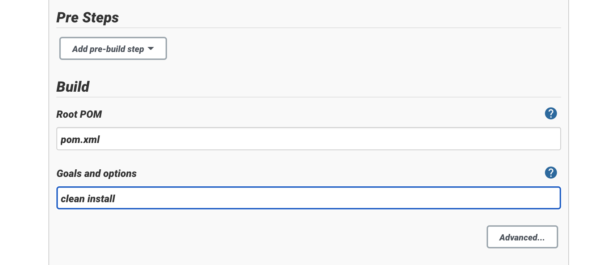
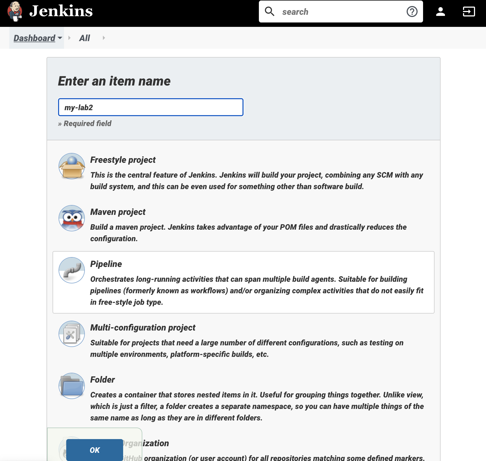

# LAB8 - Continuous integration with Jenkins

### Jenkins

_Jenkins_ é um servidor de automação gratuito. Ajuda a automatizar as partes do desenvolvimento de software relacionadas com a construção, teste e _deploy_, facilitando a integração contínua e _delivery_ contínua.

### Execução do Guião

Foi feito o download do *jenkins.war* e executado com o comando

`java -jar jenkins.war --httpPort=8080`


Posteriormente foi acedida a _Web Interface_, configurado o utilizador _Admin_, instalados todos os _plugins_ necessários e configuradas as _tools_:


Após isto, foi criado um novo _job_, configurando o projeto de uma aula anterior 




Como pedido, foi feita uma _build_ manualmente com sucesso:


Próximo passo, **configurar a _pipeline_** com um repositório remoto do projeto anterior




O novo ficheiro _Jenkins_ foi adicionado ao _GitHub_


A _build_ foi feita com sucesso


Foi configurada a estratégia de sondagem automatizada para verificar se existem novas alterações no repositório a cada 5 minutos


A _pipeline_ foi atualizada com a fase _Install_


A _build_ foi feita com sucesso


Adicionou-se um teste com o intuito de falha durante a _build_


Foi feito _commit_ e esperou-se até às 12:33:43 para verificar se a _build_ automática falha


E acabou por falhar:


**Posteriormente foi testado a _Blueocean Interface_**

Instalou-se o plugin:


E verificou-se a execução:


**Foi feito um Docker Container com o Jenkins**

Criou-se uma network


Criou-se um _Dockerfile_ que usa a _Jenkins Docker image_ e o plugin do *blueocean* 


Foi feita a _build_ da imagem


E a execução da mesma com

```jsx
docker run --name jenkins-blueocean --rm --detach \
  --network jenkins --env DOCKER_HOST=tcp://docker:2376 \
  --env DOCKER_CERT_PATH=/certs/client --env DOCKER_TLS_VERIFY=1 \
  --publish 8080:8080 --publish 50000:50000 \
  --volume jenkins-data:/var/jenkins_home \
  --volume jenkins-docker-certs:/certs/client:ro \
  myjenkins-blueocean:1.1
```


O servidor passou a estar disponível em http://localhost:8080


Foi alterado o _Jenkins file_ para refletir o pedido no guião e executar os testes dentro de um _container Docker_


Foi criada uma _pipeline_ para testar no _Jenkins_ a correr no _Docker_


Foi removido o teste a falhar


Por fim, e apesar de diversas tentativas, não foi possível executar a _pipeline_ devido a problemas de certificados do *Docker* (provavelmente devido ao *MacOS*), necessários para obter as imagens. 


Uma vez que o estudante usa o sistema operativo _MacOS_ e este não permite criar novos certificados para tentar remediar o problema, o guião deu-se por terminado.


